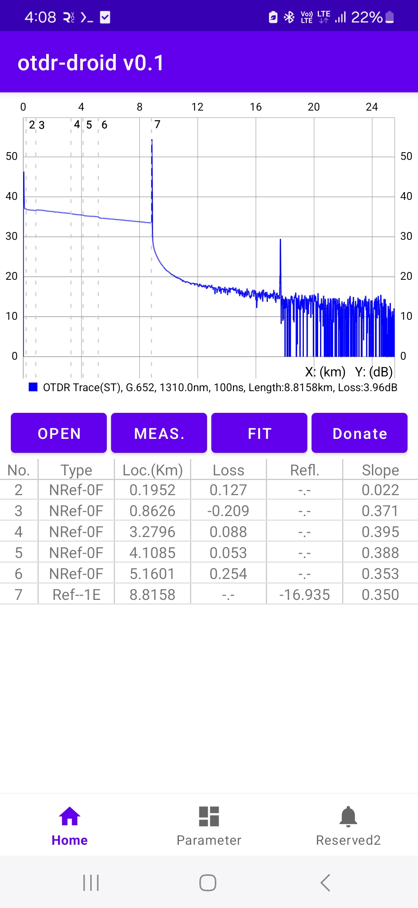
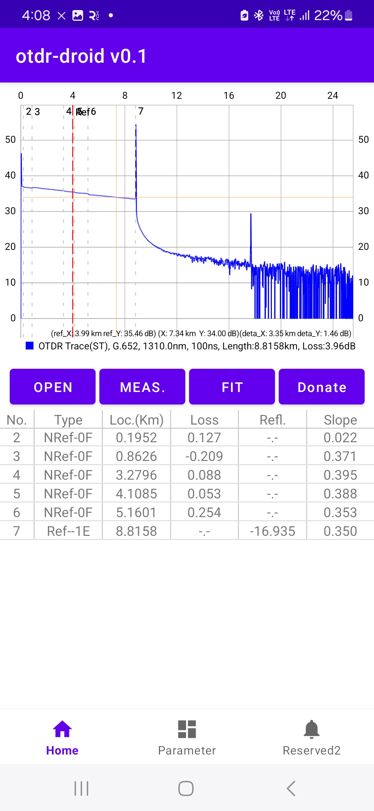
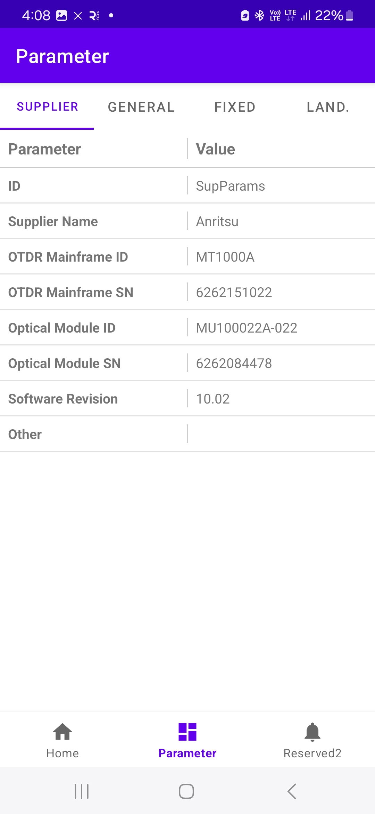

# OTDR Droid

**OTDR Droid** is an Android application developed for analyzing and visualizing OTDR (Optical Time Domain Reflectometer) trace data. It is currently under active development and available for early testing.

> 📱 Developed by **Chan**, a former hardware engineer now exploring Android development.

---

## 🔧 Features

- Load and parse `.sor` files based on Telcordia SR-4731 standard
- Visualize OTDR trace data
- Display key measurement events and parameters
- Lightweight UI, optimized for offline use

More features will be added in future releases.

---

## 📸 Screenshots

|  |  |  |
|:--:|:--:|:--:|
| Main View | Event List | Parameters View |

---

## 📥 Download APK

You can download the latest version of the app below:

👉 **[Download OTDR Droid v0.1](apk/otdr-droid%20v0.1.apk)**

> ⚠️ This is an early version. Please use for testing purposes only. Feedback and suggestions are welcome!

---

## 💬 Contact

If you have any questions or would like to contribute, feel free to open an issue or reach out via GitHub.

---

## 📄 License

This project is currently closed-source. The APK is available for testing and evaluation only.
