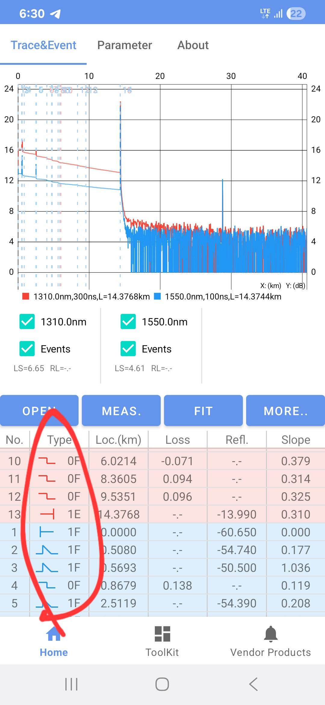
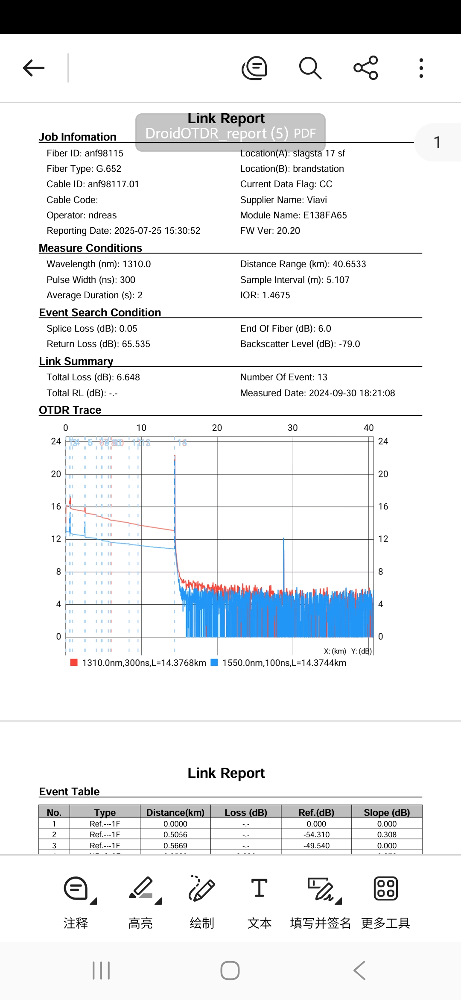
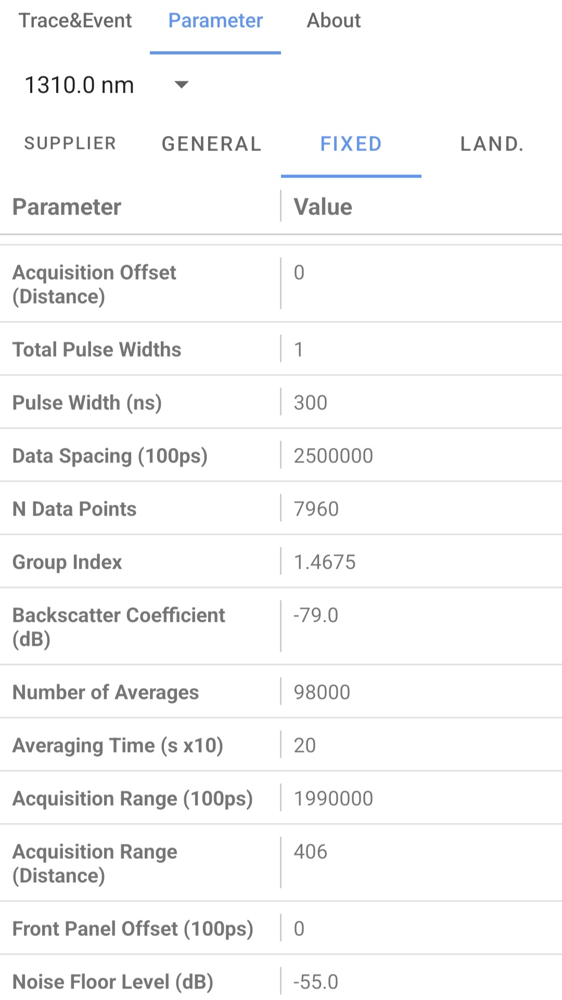
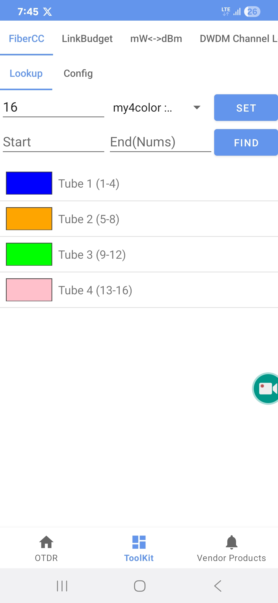
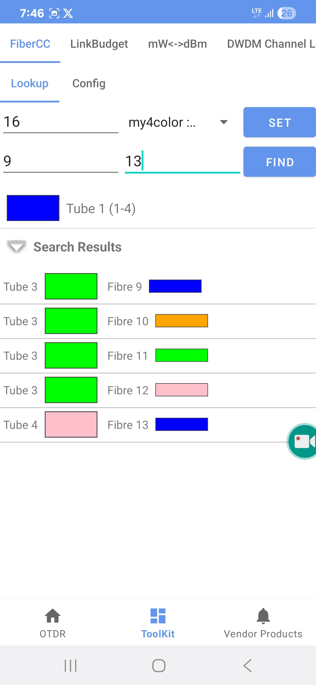
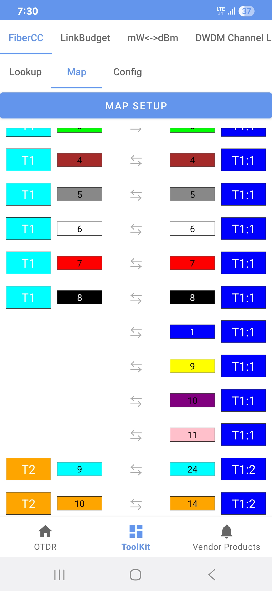
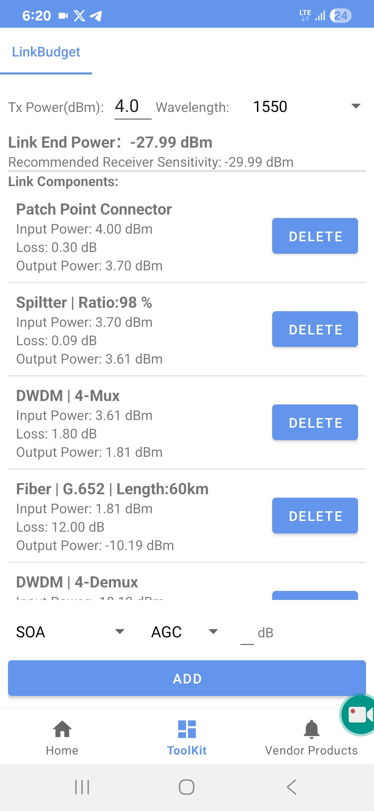
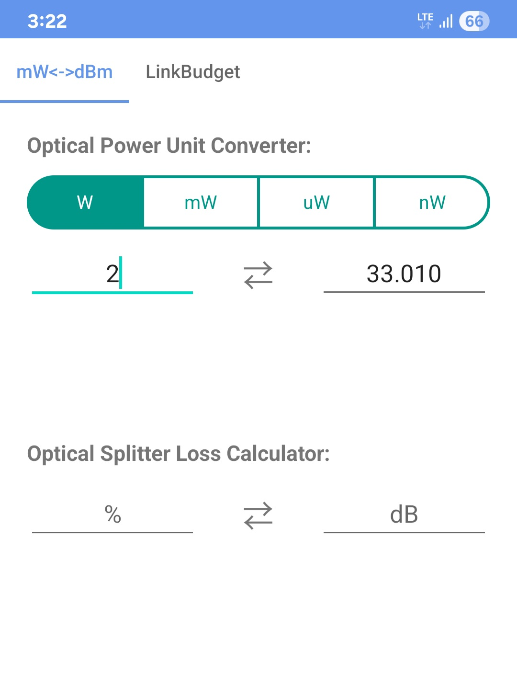
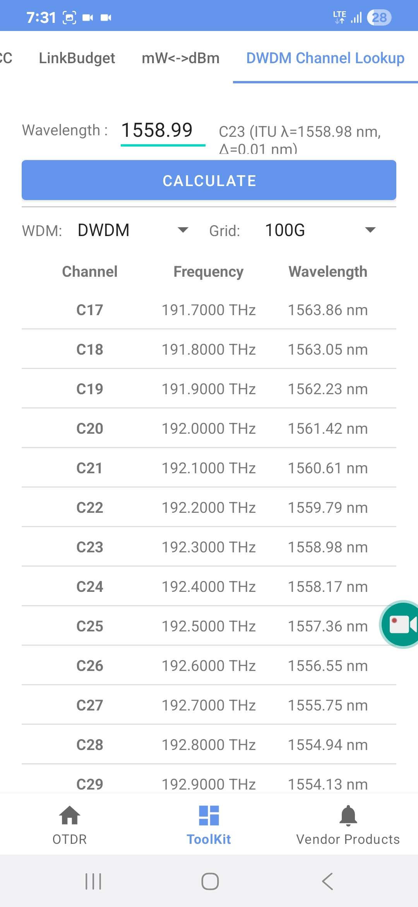

# DroidOTDR
DroidOTDR is an optical communication toolbox.

The main function is analyzing and visualizing OTDR (Optical Time Domain Reflectometer) trace data.
It also integrates a toolbox, which currently includes the following optical communication tools, with more features under development.

The DroidOTDR ToolKit currently includes the following tools:

1. Fiber Optic Cable Color Code Tool(Work in progress)
2. Optical Fiber Link Optical Power Budget Tool
3. Power Unit Converter and Splitter Loss Calculator.
4. DWDM Channel Lookup Tool

All features work offline and do not require an internet connection.

## 🔧 Features

- Load and parse .sor and .msor files based on Telcordia SR-4731 standard
- Visualize OTDR trace data
- Display key measurement events and parameters
- Lightweight UI, optimized for offline use

## 📸 Screenshots

#### 🖼️ Main View  

---

#### 🧪 PDF Report View  

---

#### ⚙️ Parameters View  

#### 🛠️ ToolKit View  

---

## 📥 Download APK

You can download the latest version of the app below:

👉 [Download DroidOTDR24.apk](https://github.com/EmbeddedChan/DroidOTDR/raw/main/apk/DroidOTDR24.apk)

This application does not request any permissions and does not collect, store, or share any user data.

## ☕ Support

If you’d like to support this project, please check out the [DONATE.md](DONATE.md) page. 🙏

## Contact
 
If you have questions, suggestions, or feedback, feel free to contact: 📧 **didadi8088@proton.me**

## Previous Versions:
 
DroidOTDR 2.4.0:
1. Added support for ribbon cables.
2. Added fiber mapping functionality.

DroidOTDR 2.3.0:
1. Fiber Optic Cable Color Code Tool(Work in progress).
2. DWDM Channel Lookup Tool .

DroidOTDR 2.2.0:
1. Added Optical Power Unit Converter.  
2. Added Splitter Loss Calculator.  

DroidOTDR 2.1.0:
1. Added a new Optical Fiber Link Power Budget Tool.  
2. Changed OTDR SOR Viewer events to icon display (PDF report export unchanged).  

DroidOTDR 2.0.0:
1. Added support for MSOR file format.  

DroidOTDR 1.x.0:
1. First release. Supports SOR 1.x and SOR 2.x file formats.