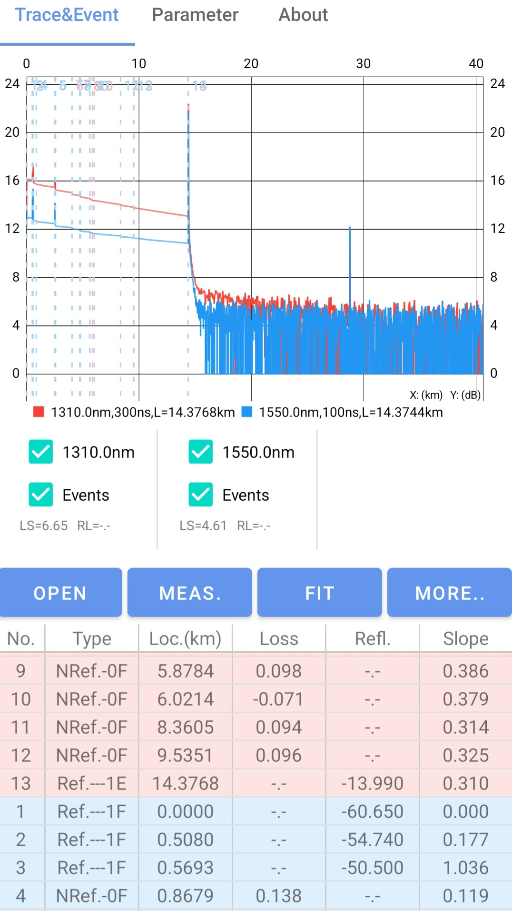

# DroidOTDR
DroidOTDR DroidOTDR is an optical communication toolbox.

The main function is analyzing and visualizing OTDR (Optical Time Domain Reflectometer) trace data.
It also integrates a toolbox, which currently includes the following optical communication tools, with more features under development.

The DroidOTDR ToolKit currently includes the following tools:

1. Fiber Optic Cable Color Code Tool(Work in progress)
2. Optical Fiber Link Optical Power Budget Tool
3. Power Unit Converter and Splitter Loss Calculator.
4. DWDM Channel Lookup Tool

All features work offline and do not require an internet connection.

## 🔧 Features

- Load and parse .sor and .msor files based on Telcordia SR-4731 standard
- Visualize OTDR trace data
- Display key measurement events and parameters
- Lightweight UI, optimized for offline use

## 📸 Screenshots

#### 🖼️ Main View  

---

#### 🧪 PDF Report View  

---

#### ⚙️ Parameters View  

---

## 📥 Download APK

You can download the latest version of the app below:

👉 [Download DroidOTDR23.apk](https://github.com/EmbeddedChan/DroidOTDR/raw/main/apk/DroidOTDR23.apk)

This application does not request any permissions and does not collect, store, or share any user data.

## ☕ Support

If you find this app helpful, you can buy me a coffee.

TronLink:
TCjJuPGA2kCLcW1Bn4nPyitPNvjuEam1W4

Bluewallet:
bc1qnandmddtn7c5vyrcdc8khkphjvtfwp92pm4xl4

MetaMask:
0xCed80d906310D26A6a4152708B4EFf14718a6100

Thank you! 🙏

## Contact
 
If you have questions, suggestions, or feedback, feel free to contact: 📧 **didadi8088@proton.me**