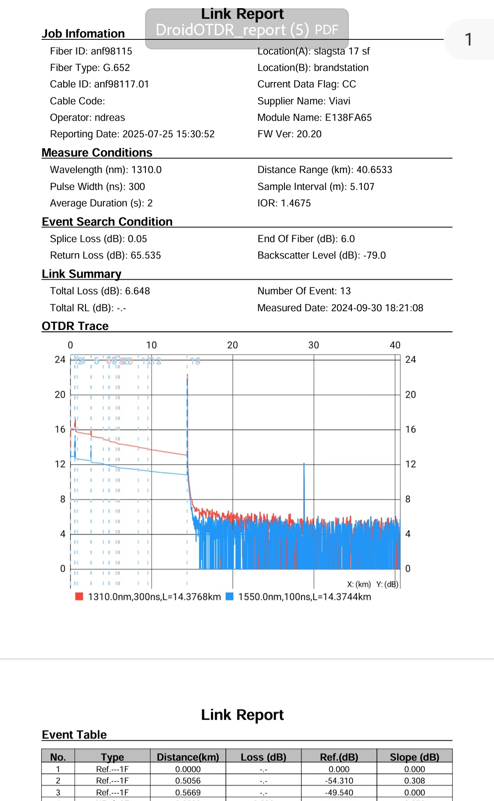

# DroidOTDR
I just released version 2.0.0 of my free Android tool for viewing OTDR trace files.
It now supports:

📁 .sor and .msor formats (Telcordia SR-4731)

📄 PDF report export for sharing results

Improved UI and fixed several bugs in version 1.0

Mainly used for analyzing fiber optic networks on mobile.

**DroidOTDR** is an Android application developed for analyzing and visualizing OTDR (Optical Time Domain Reflectometer) trace data. It is currently under active development and available for early testing.

> 📱 Developed by **Chan**, a former hardware engineer now exploring Android development.

---

## 🔧 Features

- Load and parse `.sor` files based on Telcordia SR-4731 standard
- Visualize OTDR trace data
- Display key measurement events and parameters
- Lightweight UI, optimized for offline use

More features will be added in future releases.

---

## 📸 Screenshots

#### 🖼️ Main View  

---

#### 🧪 PDF Report View  

---

#### ⚙️ Parameters View  

---

## 📥 Download APK

You can download the latest version of the app below:

👉 [Download DroidOTDR20.apk](https://github.com/EmbeddedChan/DroidOTDR/raw/main/apk/DroidOTDR20.apk)

https://www.dropbox.com/scl/fi/iknozo0bte24v4iku08nz/DroidOTDR20.apk?rlkey=nr07m8xur18h4qfwf9pniihe3&st=ny80bis9&dl=0

https://drive.google.com/file/d/1jp4zEewlvG8fUPxsOfPrQD4b-LveBVK3/view?usp=drivesdk

This application does not request any permissions and does not collect, store, or share any user data.

## ☕ Support

If you find this app helpful, you can buy me a coffee.

TronLink:
TCjJuPGA2kCLcW1Bn4nPyitPNvjuEam1W4
Bluewallet:
bc1qnandmddtn7c5vyrcdc8khkphjvtfwp92pm4xl4

MetaMask:
0xCed80d906310D26A6a4152708B4EFf14718a6100

Thank you! 🙏

## Contact
 
If you have questions, suggestions, or feedback, feel free to contact: 📧 **didadi8088@proton.me**